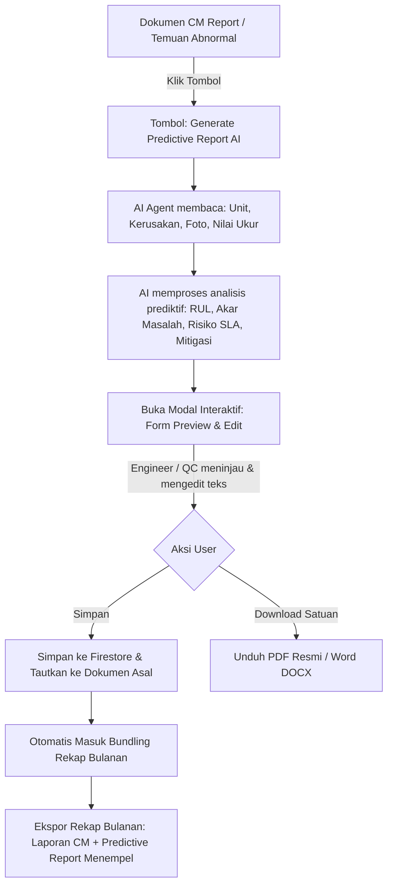

# Implementation Plan: Sistem Predictive Maintenance Report Berbasis AI Agent

> **Project**: DwimitraSystem — Data Center Maintenance Documentation & Reporting System  
> **Lokasi**: PT Dwimitra Ekatama Mandiri / PT UTT — Data Center NeutraDC Cikarang  
> **File Dokumen**: `predictive report.md`  
> **Status**: Design & Implementation Blueprint  

---

## 1. Latar Belakang & Konsep Arsitektur

### 1.1. Korelasi Temuan Abnormal (CM) dengan Predictive Maintenance (PdM)
Dalam operasional fasilitas *Mission Critical Data Center* (Tier III / Tier IV) di NeutraDC Cikarang, laporan **Corrective Maintenance (CM)** atau temuan kondisi abnormal dari pemeliharaan rutin tidak boleh berhenti hanya pada status *"sudah diperbaiki/diganti"*. 

Pihak manajemen fasilitas dan auditor SLA data center selalu membutuhkan **Predictive Maintenance Report (PdM)** untuk:
1. Mengetahui **akar masalah teknis** (*Root Cause & Failure Mode Analysis*).
2. Memprediksi **pola kerusakan lanjutan** (*Degradation Pattern*) jika peralatan terus dibebani.
3. Mengestimasi **sisa umur pakai** (*Remaining Useful Life / RUL*) komponen terkait.
4. Menilai **risiko terhadap SLA & redundansi data center** (misal risiko turunnya redundansi $N+1$ menjadi $N$ pada sistem daya/pendingin).
5. Merancang **jadwal mitigasi terencana** (*Predictive Action Plan*) sebelum terjadi *unscheduled downtime* atau *cascading failure*.

### 1.2. Peran AI Agent Genius
Sistem dilengkapi AI Agent cerdas (Google Gemini) yang dilatih khusus dengan prompt standar *electrical & mechanical mission critical data center* (IEEE, ASHRAE, NFPA 70B, dan Tier Standard Uptime Institute). AI bertugas menganalisis data temuan abnormal, parameter terukur, dan foto bukti lapangan secara otomatis, kemudian merumuskan draf laporan prediktif yang komprehensif dan akurat.

### 1.3. Prinsip Bundling 1-to-1 (Tidak Terpisah Saat Rekap Bulanan)
Laporan Predictive Maintenance **menempel erat (linked 1-to-1)** dengan laporan CM / temuan abnormal asalnya:
- Saat dibuka satuan, Predictive Report dapat diunduh sebagai berkas resmi mandiri (PDF / DOCX).
- Saat dilakukan **Rekap Bulanan (Monthly Report / Resume)**, Predictive Report **tidak tercecer atau berdiri sendiri**, melainkan otomatis terlampir di bawah laporan CM/Abnormal asalnya, menciptakan satu paket alur utuh:
  $$\text{Kejadian Kerusakan (CM)} \longrightarrow \text{Tindakan Korektif Lapangan} \longrightarrow \text{Analisis Prediktif AI (PdM Report)}$$

---

## 2. Struktur Data Model (TypeScript & Firestore)

### 2.1. Tipe Data `PredictiveReportData`
File target: `frontend/types/predictiveReportTypes.ts`

```typescript
export interface PredictiveReportData {
  id: string; // ID Dokumen PdM (e.g. "PDM_20260912_001")
  reportNumber: string; // Nomor Resmi: PDM/DME-NDC/YYYY/MM/XXXX
  createdAt: Date;
  updatedAt: Date;
  createdBy: string; // Email akun pembuat (Standby Engineer / QC DME)
  
  // ─── Referensi Dokumen Asal (Parent Linking) ─────────────────────────
  sourceDocId: string; // ID dokumen laporan CM atau arsip temuan abnormal
  sourceCollection: 'excel_documents' | 'pdf_documents' | 'findings' | 'cm_reports';
  sourceTicketNumber?: string; // Nomor tiket CM / No Laporan asal
  sourceMaintenanceName: string;
  sourceMaintenanceDate: string;

  // ─── Bagian 1: Identitas Peralatan (Asset Identification) ───────────
  equipmentName: string; // e.g. "Fuel Pump Supply 2", "Chiller 03", "Trafo B"
  equipmentTag?: string; // e.g. "PUMP-FS-02", "CH-03-A"
  systemCategory: 'Fuel System' | 'HVAC / Cooling' | 'Electrical Distribution' | 'UPS & Battery' | 'Fire Protection' | 'General Facility';
  locationRoom: string; // e.g. "Power House Lt. 1", "Chiller Yard", "Data Hall 1"
  brandModel?: string; // e.g. "Kirloskar / Kyoritsu KEW 3125B"

  // ─── Bagian 2: Kondisi Aktual & Gejala Awal (Anomaly Drift) ──────────
  healthStatus: 'Critical' | 'Warning' | 'Caution'; // Status Keparahan
  currentSymptoms: string; // Deskripsi gejala kerusakan terdeteksi
  measuredParameterDrift?: {
    parameterName: string; // e.g. "Insulation Resistance Phase-to-Ground"
    measuredValue: string; // e.g. "0.1 MΩ @ 250V"
    nominalBaseline: string; // e.g. "≥ 100 MΩ"
    unit: string;
  }[];
  photoEvidenceBase64?: string; // Foto bukti temuan dari CM/Abnormal
  photoCaption?: string;

  // ─── Bagian 3: Analisis Prediktif AI (AI Engineering Insight) ────────
  aiAnalysis: {
    rootCauseAnalysis: string; // Analisis penyebab utama terjadinya anomali
    potentialFailureMode: string; // Modus kegagalan jika tidak ditangani
    remainingUsefulLife: string; // Estimasi sisa umur pakai (e.g. "7 - 14 Hari")
    urgencyLevel: 'Emergency' | 'High' | 'Medium' | 'Low';
    slaRiskAssessment: string; // Potensi dampak terhadap uptime beban kritis server
  };

  // ─── Bagian 4: Rencana Tindakan Prediktif (Action Plan) ──────────────
  actionPlan: {
    immediateAction: string; // Tindakan stabilisasi jangka pendek (1 - 7 hari)
    plannedOverhaulAction: string; // Tindakan perbaikan definitif / overhaul (2 - 4 minggu)
    recommendedSpareparts: {
      partName: string;
      partNumber?: string;
      quantity: string | number;
      urgency: 'Ready Stock' | 'Indent Procurement' | 'Critical Backup';
    }[];
    followUpTestingMethods: string[]; // e.g. ["Thermography Scanning", "Megger Test", "Vibration Analysis"]
  };

  // ─── Bagian 5: Lembar Pengesahan (Approval Sheet) ────────────────────
  signatures: {
    preparedBy: {
      name: string;
      title: string; // "Standby Engineer PT DME"
      signatureBase64?: string;
      date: string;
    };
    verifiedBy: {
      name: string;
      title: string; // "Quality Control DME"
      signatureBase64?: string;
      date: string;
    };
    approvedBy: {
      name: string;
      title: string; // "Site Manager NeutraDC Cikarang"
      signatureBase64?: string;
      date: string;
    };
  };
}
```

---

## 3. Alur Kerja Pengguna (User Flow)



### 3.1. Penempatan Tombol di Antarmuka (UI)
Sesuai hasil diskusi, tombol `[🤖 Generate Predictive Report (AI)]` diletakkan di **dua lokasi strategis**:
1. **Di Modal / Form CM Report (`CMReportFormModal.tsx`)**:
   - Ditaruh pada Step rincian perbaikan / tinjauan laporan CM, sehingga teknisi yang baru saja selesai mengisi kronologi perbaikan dapat langsung men-generate laporan prediktif unit tersebut.
2. **Di Pusat Temuan Kondisi Abnormal (`AbnormalFindingsCenter.tsx`)**:
   - Ditaruh pada setiap kartu temuan abnormal dan pada modal pop-up detail temuan abnormal, memberi keleluasaan bagi QC DME untuk men-generate analisis prediktif dari seluruh data yang masuk.

---

## 4. Rincian Form Interaktif (5 Bagian Utama)

Saat AI selesai memproses data, muncul modal antarmuka elegan bertema **Deep Indigo & Slate Modern** (`PredictiveReportModal.tsx`) dengan 5 bagian yang dapat ditinjau dan diedit:

### Bagian 1: Identitas Dokumen & Aset
- **Kop Surat Visual**: Pratinjau Logo Dwimitra (Kiri) dan Logo NeutraDC (Kanan).
- **No. Dokumen PdM**: Format otomatis `PDM/DME-NDC/YYYY/MM/XXXX`.
- **Nama Unit & Lokasi**: Input teks terisi otomatis (misal: *Fuel Pump Supply 2 — Power House*).
- **Sistem & Kategori**: Pilihan dropdown (*Fuel System, Electrical, HVAC/Chiller, UPS, Fire System*).

### Bagian 2: Kondisi Aktual & Anomali Lapangan
- **Status Keparahan**: Badge pemilih warna (*Kritis / Peringatan / Perhatian*).
- **Gejala Kerusakan**: Textarea deskripsi gejala lapangan yang terdeteksi.
- **Tabel Nilai Ukur Drift**: Parameter terukur vs baseline standar (misal: *Insulation Resistance: 0.1 MΩ vs Normal ≥ 100 MΩ*).
- **Foto Dokumentasi Bukti**: Tampilan thumbnail foto temuan dari laporan CM.

### Bagian 3: Analisis Prediktif AI (AI Intelligence)
- **Akar Masalah (Root Cause)**: Analisis teknis mendalam penyebab kerusakan komponen.
- **Potensi Modus Kegagalan (FMEA)**: Analisis progresi eskalasi kegagalan dan dampak cascading.
- **Estimasi Sisa Umur (RUL)**: Prediksi sisa waktu operasional aman (misal: *7 - 14 Hari*).
- **Analisis Dampak SLA**: Penjelasan risiko terhadap redundansi $N+1$ dan beban server data hall.

### Bagian 4: Rencana Tindakan Prediktif (Action Plan)
- **Tindakan Cepat (Immediate Action: 1-7 Hari)**: Langkah pencegahan sementara.
- **Tindakan Perbaikan Terencana (Planned Action: 2-4 Minggu)**: Rencana overhaul / servis besar.
- **Kebutuhan Suku Cadang Kritis**: Daftar part cadangan yang harus disiapkan.
- **Metode Uji Verifikasi Lanjutan**: Checkbox opsi (*Megger, Thermovisi, Getaran, Uji Beban*).

### Bagian 5: Pengesahan Dokumen
- Penandatangan 3 Pihak: Engineer Pembuat, QC DME Pemeriksa, dan Site Manager NeutraDC Penyetuju.

---

## 5. Generator Berkas Dokumen Resmi (PDF & DOCX)

### 5.1. Tata Letak Ekspor Microsoft Word (.DOCX)
- Modul: `frontend/utils/PredictiveReportWordExport.ts`
- **Kop Surat 3 Kolom**: Logo Dwimitra (kiri), Judul & No Dokumen PdM (tengah), Logo NeutraDC (kanan).
- **Styling Warna**:
  - Warna Utama Header: *Deep Navy / Corporate Blue (`#00599C`)* dan *Accent Amber/Rose*.
  - Callout Box terarsir untuk Analisis AI dan Rencana Tindakan.
  - Penyesuaian aspek rasio foto bukti otomatis (anti-gepeng).
- **Tabel Pengesahan 3 Kolom**: Kolom tanda tangan resmi di akhir halaman.

### 5.2. Tata Letak Ekspor PDF Resmi
- Modul: `frontend/utils/PredictiveReportPdfExport.ts` (menggunakan `jspdf` & `jspdf-autotable`).
- Standar dokumen formal A4 vertikal dengan header logo ganda beresolusi tinggi.

### 5.3. Bundling Rekap Bulanan (Monthly Report Integration)
- Pada generator rekapitulasi bulanan:
  - Setiap laporan CM/Abnormal dicek apakah memiliki tautan data `predictiveReport`.
  - Jika ada, laporan bulanan secara berurutan menyisipkan lembar Predictive Report AI tepat di halaman setelah laporan CM tersebut, tanpa memisahkan identitas keduanya.

---

## 6. Prompt Engineering untuk AI Agent

Prompt sistem yang ditanamkan ke pipeline AI Google Gemini (`frontend/utils/aiPredictiveAgent.ts`):

```text
You are an elite Mission Critical Data Center Reliability & Predictive Maintenance Engineer (CRE/CMRP certified) for NeutraDC Cikarang / PT Dwimitra Ekatama Mandiri.

Given the Corrective Maintenance (CM) finding data, measured parameter values, and equipment photo:
1. Identify the fundamental Root Cause & Failure Mode based on physics of failure (thermal, mechanical, dielectric, or chemical degradation).
2. Predict the Degradation Pattern and estimate Remaining Useful Life (RUL) before total catastrophic breakdown.
3. Quantify the operational impact on Data Center Tier III/IV SLA, IT load availability, and N+1 / 2N redundancy margins.
4. Prescribe a concrete, time-phased Predictive Action Plan (Immediate 1-7 days vs Planned Overhaul 2-4 weeks).
5. Specify required critical spare parts and predictive verification testing methods (Thermography, Megger Insulation, Vibration Spectrum, Oil Dielectric).

Output must be in structured, professional Bahasa Indonesia technical terminology.
```

---

## 7. Rencana Tahapan Eksekusi (Implementation Checklist)

- [ ] **Tahap 1: Tipe Data & Pipeline AI**
  - Membuat `frontend/types/predictiveReportTypes.ts`.
  - Membuat `frontend/utils/aiPredictiveAgent.ts` untuk memanggil Google Gemini AI dengan struktur output JSON terstandar.
- [ ] **Tahap 2: Modal UI Form Preview & Edit**
  - Membuat komponen `frontend/components/PredictiveReportModal.tsx`.
  - Mengakomodasi preview interaktif, edit manual setiap field, dan penyimpanan ke Firestore.
- [ ] **Tahap 3: Generator Dokumen Resmi (PDF & DOCX)**
  - Membuat `frontend/utils/PredictiveReportWordExport.ts` (DOCX resmi ber-kop surat logo Dwimitra & NeutraDC).
  - Membuat `frontend/utils/PredictiveReportPdfExport.ts` (PDF resmi).
- [ ] **Tahap 4: Integrasi Tombol Generate AI**
  - Memasang tombol `[🤖 Generate Predictive Report (AI)]` pada `frontend/components/CMReportFormModal.tsx`.
  - Memasang tombol `[🤖 Generate Predictive Report (AI)]` pada `frontend/components/AbnormalFindingsCenter.tsx`.
- [ ] **Tahap 5: Bundling Rekap Bulanan**
  - Menghubungkan data PdM ke generator rekap bulanan agar laporan CM dan Predictive Report otomatis menyatu rapi.
- [ ] **Tahap 6: Uji Coba & Validasi**
  - Menjalankan `npm run build` untuk validasi zero-error TypeScript.
  - Melakukan pengujian alur pembuatan laporan CM $\rightarrow$ generate AI $\rightarrow$ edit $\rightarrow$ ekspor dokumen $\rightarrow$ verifikasi rekap bulanan.

---

*Dokumen ini disusun sebagai blueprint resmi pengembangan fitur Predictive Maintenance Report AI pada sistem DwimitraSystem.*
